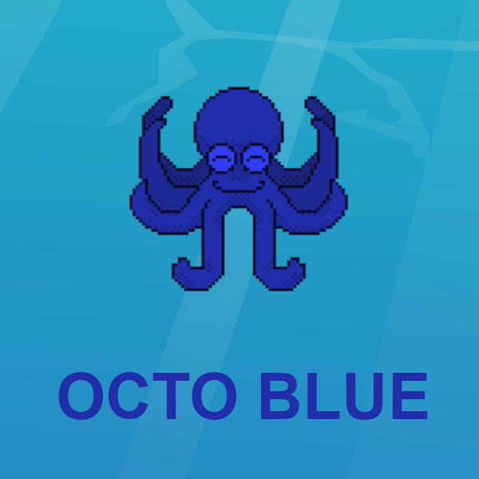

# OCTO blue | Game Jam de D'JAMBO

## Sommaire

1. [Introduction](#introduction)  
   1.1 [Présentation de la Game Jam](#présentation-de-la-game-jam)  
   1.2 [Game Jam Overview](#game-jam-overview)  
2. [À propos du jeu | About the Game](#à-propos-du-jeu--about-the-game)  
   2.1 [Concept](#concept)  
   2.2 [Gameplay](#gameplay)  
3. [Technologies utilisées | Technologies Used](#technologies-utilisées--technologies-used)  
4. [Installation](#installation)  
   4.1 [Étapes d'installation | Installation Steps](#étapes-dinstallation--installation-steps)  
5. [Crédits | Credits](#crédits--credits) 

---

## Introduction [^](#sommaire)

### Français

### Présentation de la Game Jam [^](#sommaire)

La D'jambo est une game jam en ligne qui s'est déroulée du **vendredi 17 janvier 2025** à 18h au **dimanche 19 janvier 2025** à 18h. Les participants disposaient de **48 heures** pour créer un **jeu vidéo** en solo ou en équipe de 1 à 5 personnes.

Le thème de cette édition était **Monochrome**, dévoilé au début de l'événement. Les participants étaient libres d'utiliser la technologie de leur choix (Godot, Unreal, Unity, etc.) pour développer des jeux destinés aux **plateformes mobiles**, **desktop** ou **web**, adaptés aux **écrans tactiles**, **claviers/souris** ou **manettes**.

### English

### Game Jam Overview [^](#sommaire)

The D'jambo is an online game jam that took place from **Friday, January 17, 2025**, at 6 PM to **Sunday, January 19, 2025**, at 6 PM. Participants had **48 hours** to create a **video game**, either solo or in teams of 1 to 5 people.

The theme of this edition was **Monochrome**, revealed at the start of the event. Participants were free to use the technology of their choice (Godot, Unreal, Unity, etc.) to develop games for **mobile**, **desktop**, or **web platforms**, designed for **touchscreens**, **keyboards/mice**, or **controllers**.

---

## À propos du jeu | About the Game [^](#sommaire)

  

### Français

### Concept [^](#sommaire)

Dans **OCTO Blue**, le joueur incarne **Octo**, une pieuvre bienveillante qui utilise son **encre magique** pour répandre la **joie**. Des poissons tristes, d'un **bleu sombre**, nagent devant elle. Grâce à ses pouvoirs, Octo transforme leur couleur en un **bleu éclatant**, leur rendant le **sourire**.

Le jeu se joue avec les touches du clavier :

- **Flèches droite** et **gauche** pour déplacer Octo.
- **Touche espace** pour tirer de l'encre.
- À chaque fois qu'un poisson est touché, il change de couleur.

### English

### Gameplay [^](#sommaire)

In **OCTO Blue**, the player controls **Octo**, a kind-hearted octopus who uses her **magical ink** to spread **joy**. Sad fish, with a **dark blue** color, swim in front of her. With her powers, Octo transforms their color into a **bright blue**, bringing a **smile** to their faces.

The game is played using the keyboard:

- **Right** and **Left arrows** to move Octo.
- **Spacebar** to shoot ink.
- Each time a fish is hit, it changes color.

---

## Technologies utilisées | Technologies Used [^](#sommaire)

### Français

Le jeu est programmé en **HTML**, **CSS** et **JavaScript**, sans l'utilisation de frameworks. Il est uniquement disponible pour les versions **PC**.

### English

The game is programmed in **HTML**, **CSS**, and **JavaScript**, with no frameworks used. It is available only for **PC** versions.

---

## Installation [^](#sommaire)

### Français

### Étapes d'installation | Installation Steps [^](#sommaire)

1. Le jeu est disponible sur la page suivante : [https://babbou.itch.io/octo-blue](https://babbou.itch.io/octo-blue).

2. Il n'est pas nécessaire de le télécharger, le jeu est jouable directement sur la page web.

### English

1. The game is available on the following page: [https://babbou.itch.io/octo-blue](https://babbou.itch.io/octo-blue).

2. No download is required, the game is playable directly on the webpage.

---

## Crédits | Credits [^](#sommaire)

### Français

- **Développeur :** Fabrice ATLAN
- **Graphisme :** Fabrice ATLAN
- **Outils utilisés :** Visual Studio Code, Git, GitHub, Pyxel Edit

### English

- **Lead Developer :** Fabrice ATLAN
- **Graphics :** Fabrice ATLAN
- **Tools Used :** Visual Studio Code, Git, GitHub, Pyxel Edit
